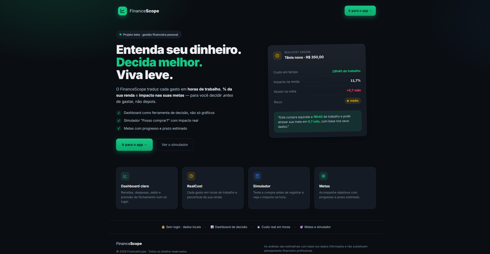
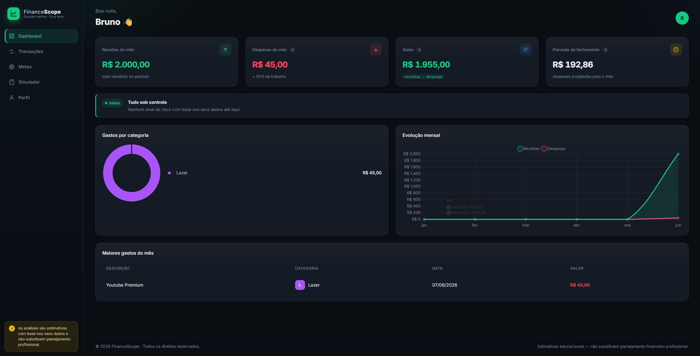
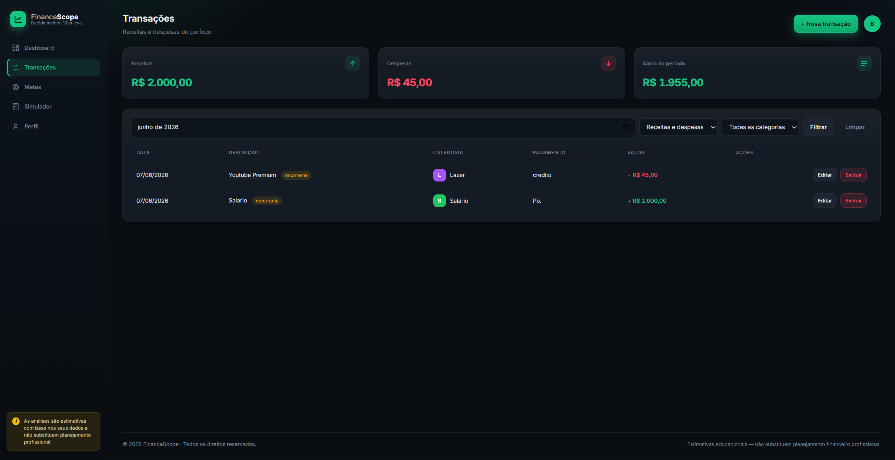
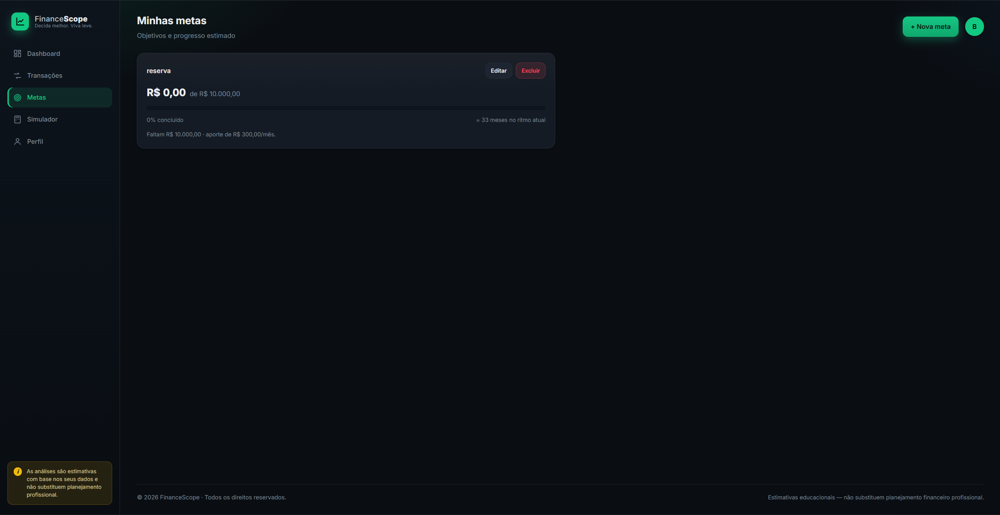
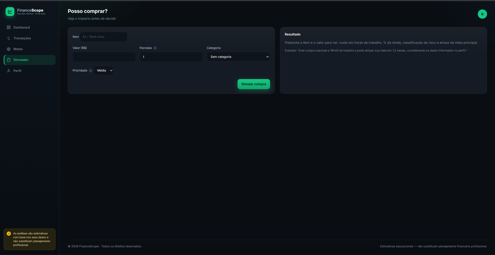
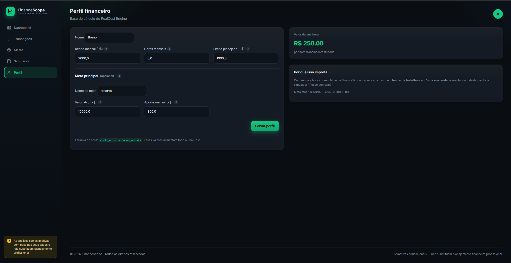
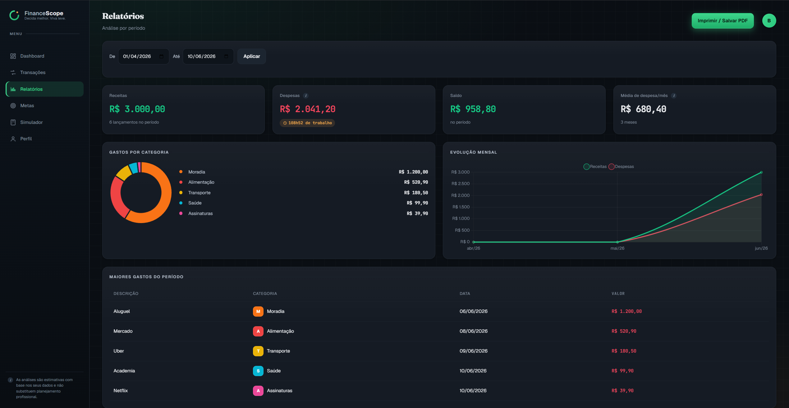

# FinanceScope

[](https://github.com/BrunoCarreiroCS/FinanceScope/actions/workflows/ci.yml)


> **Entenda seu dinheiro. Decida melhor. Viva leve.**

Sistema web de gestão financeira pessoal com foco em **decisão**, não só em
registro.

Em vez de mostrar onde o dinheiro foi, ajuda a responder:

> *"Posso comprar isso?"*

Traduzindo cada gasto em **horas de trabalho**, **impacto na renda** e
**atraso nas metas**.

🌐 **Demo online:** <https://brunoso.pythonanywhere.com>

🔑 **Conta de teste:** `demo@financescope.app` / `demo1234`

---

## 🎯 Problema que resolvi

A maioria dos apps de finanças mostra ao usuário **onde o dinheiro foi gasto
depois que o gasto já aconteceu**.

O FinanceScope inverte essa lógica: ajuda a **decidir antes de comprar**,
traduzindo a compra em três dimensões reais:

- ⏱️ **Horas de trabalho** que ela custa
- 📉 **Impacto percentual** na renda
- 🎯 **Atraso** nas metas financeiras

Assim, o app não funciona apenas como histórico financeiro, mas como uma
**ferramenta de tomada de decisão**.

---

## ✨ O diferencial: RealCost Engine

Um tênis de R$ 350 não custa "R$ 350".

Ele custa **18h40 de trabalho**, **11,7% da sua renda do mês** e atrasa sua
reserva em cerca de **21 dias**.

E quando a compra é pequena demais para importar, o app diz isso com todas
as letras — *"esta compra não deve influenciar sua meta principal"* — em vez
de assustar com um "0.0 meses".

Esses cálculos rodam em **toda compra**: no dashboard, no detalhe de cada
despesa e no simulador "Posso comprar?" — que dá um veredito claro:

| Veredito | Quando |
|---|---|
| 🟢 **Vale a pena** | impacto mensal < 5% |
| 🟡 **Melhor esperar** | 5% – 15% |
| 🔴 **Não compre agora** | > 15% |

Sempre com explicação. Sugere, **não manda**.

---

## 📸 Telas

### Landing
*Entenda seu dinheiro. Decida melhor. Viva leve.*



### Dashboard
Cards, alertas, gráficos e ranking dos maiores gastos.



### Transações
Listagem com filtros e categorias coloridas.



### Metas
Progresso e prazo estimado pelo RealCost.



### Simulador "Posso comprar?"
Veredito de decisão antes do gasto.



### Perfil
Base de cálculo do RealCost (renda, horas, meta).



### Relatórios
Análise por período com gráficos e exportação para PDF.



---

## 💪 Principais competências demonstradas

- **Backend** — Flask 3, factory pattern, sessões, autenticação
- **Segurança** — hash de senha (Werkzeug), proteção CSRF, cookies hardened
- **Banco de dados** — SQLite com constraints e foreign keys (5 tabelas)
- **Regras de negócio** — RealCost Engine centralizado e testável
- **Testes** — pytest com 61 testes (auth, RealCost, relatórios, CSV)
- **CI/CD** — GitHub Actions (Python 3.11 e 3.12) + ruff (lint)
- **Deploy** — PythonAnywhere com HTTPS e banco persistente
- **Frontend** — CSS puro (~1.100 linhas, sem framework), design system
  próprio com tokens, motion orquestrado e acessibilidade (ARIA, reduced-motion)
- **Identidade visual** — marca vetorial própria, tipografia editorial
  (Fraunces + Geist + JetBrains Mono) e conceito "Relógio de Vida"
- **Visualização** — Chart.js (donut, linha) + dial de tempo em CSS puro
  (conic-gradient animado)
- **Importação** — parser flexível de CSV de extratos bancários
- **Documentação** — README, DEPLOY, comentários e docstrings

---

## 🚀 Funcionalidades

| Módulo | O que faz |
|---|---|
| 🔐 Login | Cadastro/login multiusuário com senha em hash + CSRF |
| 📊 Dashboard | Saldo com anel "Relógio de Vida", previsão e alertas |
| 💸 Transações | CRUD com filtros (mês/tipo/categoria) |
| 📥 Importação CSV | Upload de extratos com pré-visualização |
| 🧮 RealCost | Cada gasto em horas, % e atraso na meta |
| 🎯 Metas | Progresso, prazo estimado e prioridades |
| 🛒 Simulador | "Posso comprar?" com veredito de decisão |
| 📈 Relatórios | Análise por período com exportação para PDF |
| 💡 Tooltips | Cada termo financeiro explicado em linguagem clara |

---

## 🛠️ Tecnologias

**Backend**
- Python 3.11 · Flask 3
- SQLite (1 arquivo, sem servidor)
- Werkzeug (scrypt para senhas)

**Frontend**
- Jinja2 · CSS puro
- Tipografia: Fraunces (display) · Geist (corpo) · JetBrains Mono (valores)
- Chart.js (CDN)

**Qualidade**
- pytest (61 testes)
- ruff (linter)
- GitHub Actions (CI)

**Deploy**
- PythonAnywhere (HTTPS, banco persistente, gratuito)

> **Por que sem framework de CSS?** Tudo é CSS próprio (~1.100 linhas) —
> design tokens, grid/flex, motion com `@keyframes` + `@property`
> (anéis animados via `conic-gradient`), `prefers-reduced-motion`,
> responsivo com `safe-area-inset` (notch do iPhone) e tema claro
> para impressão do PDF.

---

## 🧮 As fórmulas (transparência total)

Todas centralizadas em
[`app/utils/finance.py`](app/utils/finance.py) e cobertas por testes em
[`app/tests/test_finance.py`](app/tests/test_finance.py).

| Cálculo | Fórmula |
|---|---|
| Valor da hora | `renda_mensal / horas_mensais` |
| Custo em horas | `valor / valor_da_hora` |
| Impacto na renda | `(valor / renda_mensal) × 100` |
| Saldo do mês | `receitas − despesas` |
| Previsão de fechamento | `média_diária_despesas × dias_do_mês` |
| Tempo da meta | `(alvo − atual) / aporte_mensal` |
| Atraso da meta | `valor_compra / aporte_mensal` |

O app **mostra** as fórmulas ao lado dos resultados — transparência aumenta
confiança e ensina enquanto usa.

---

## 🎨 Identidade visual: "Relógio de Vida"

O design parte da mesma ideia do produto — **dinheiro é tempo** — e a
transforma em linguagem visual:

- 🟢 **Jade** (`#3dd68c`) é a cor do *dinheiro*: marca, botões, destaques
- 🟠 **Âmbar** (`#f0a64b`) é a cor do *tempo*: dials, chips de horas,
  anéis de progresso
- ⭕ **A logo** é um anel aberto com um ponto âmbar — o mesmo dial que
  aparece no dashboard mostrando quanto do seu mês de trabalho as
  despesas já consumiram
- 📰 **Camada editorial**: tipografia serifada de display (Fraunces) nas
  manchetes, kickers em caps com fios finos (estética de revista) e
  valores financeiros em monospace (JetBrains Mono)

Os dados financeiros (verde "alta" / vermelho "baixa") ficam **separados
das cores de marca** — como em produtos financeiros sérios.

---

## ▶️ Como usar

### Online (sem instalar nada)

1. Acesse <https://brunoso.pythonanywhere.com>
2. Entre com a conta demo **ou** crie a sua
3. Preencha o perfil (renda, horas, meta)
4. Cadastre transações ou importe um CSV
5. Use o dashboard, os relatórios e o simulador

### Localmente

```bash
cd app
python -m venv .venv
.venv\Scripts\activate          # Windows
source .venv/bin/activate        # Linux/Mac

pip install -r requirements-dev.txt
flask init-db                    # cria as tabelas
flask seed-demo                  # opcional: usuário e dados demo
flask run
```

Acesse <http://127.0.0.1:5000>.

### Rodar os testes

```bash
cd app
pytest
```

### Deploy gratuito

Guia passo a passo no PythonAnywhere (grátis, HTTPS, banco persistente):
**[`DEPLOY.md`](DEPLOY.md)**

---

## 🗂️ Arquitetura

```
app/
├── app.py                  # rotas, autenticação, regras de negócio
├── database.py             # conexão SQLite + flask init-db
├── schema.sql              # 5 tabelas
├── seeds.py                # flask seed-demo
├── utils/
│   ├── finance.py          # RealCost Engine
│   ├── reports.py          # agregações de dashboard e relatórios
│   ├── csv_import.py       # parser flexível de extratos
│   └── forms.py            # parsing/validação de inputs
├── templates/              # Jinja2 (landing, auth, app)
├── static/                 # CSS, JS, logo SVG, favicon
└── tests/                  # pytest (61 testes)
```

**Padrões aplicados:**

- Factory pattern (`create_app`)
- Context managers (Flask `g`)
- Validação em camadas (HTML5 + Python + constraints SQL)
- POST/Redirect/GET
- Mensagens flash
- Sanitização contra SQL-injection (parâmetros)
- Hash de senha e proteção CSRF
- Separação clara entre dados, regras e apresentação

---

## 🛤️ Como foi construído

Projeto desenvolvido por **fases**, com commits organizados:

| Fase | Entrega |
|---|---|
| 1 | Estrutura Flask, layout dark, navegação |
| 2 | Perfil financeiro |
| 3 | CRUD de transações com filtros |
| 4 | Dashboard com cards, gráficos e alertas |
| 5 | RealCost em detalhes de despesa |
| 6 | Metas e Simulador com veredito |
| 7 | Login multiusuário, polimento, deploy |
| ➕ | CSRF, relatórios + PDF, importação CSV |

O plano técnico original está em [`docs/`](docs/) (PDF e DOCX).

---

## 🔮 Roadmap futuro

- 🤖 **Chatbot com IA** — assistente conversacional sobre os próprios
  dados ("quanto gastei com lazer?", "quando atinjo a meta?", "o que cortar?")
- 📊 **Score financeiro** evolutivo (saúde do mês)
- 🔁 **Assinaturas** (custo anual de recorrentes)
- 📱 **App mobile** dedicado / PWA
- 🏦 **Integração bancária** (Open Finance via Pluggy)
- 📤 **Exportação CSV** dos próprios dados

---

## ⚖️ Aviso

As análises do FinanceScope são **estimativas educacionais** baseadas nos
dados que você informa.

**Não substituem** orientação financeira profissional.

O produto **sugere**, não impõe. Termos como *"estimativa"*, *"no ritmo
atual"* e *"com base nos seus dados"* são propositais — você é quem decide.

---

## 👤 Autor

**Bruno Carreiro dos Santos**

- 🐙 GitHub: <https://github.com/BrunoCarreiroCS>
- 💼 LinkedIn: <https://www.linkedin.com/in/bruno-carreiro-dos-santos-2006-eng/>
- ✉️ E-mail: <brunocarreirodossantos12@gmail.com>

---

© 2026 FinanceScope · Todos os direitos reservados.
